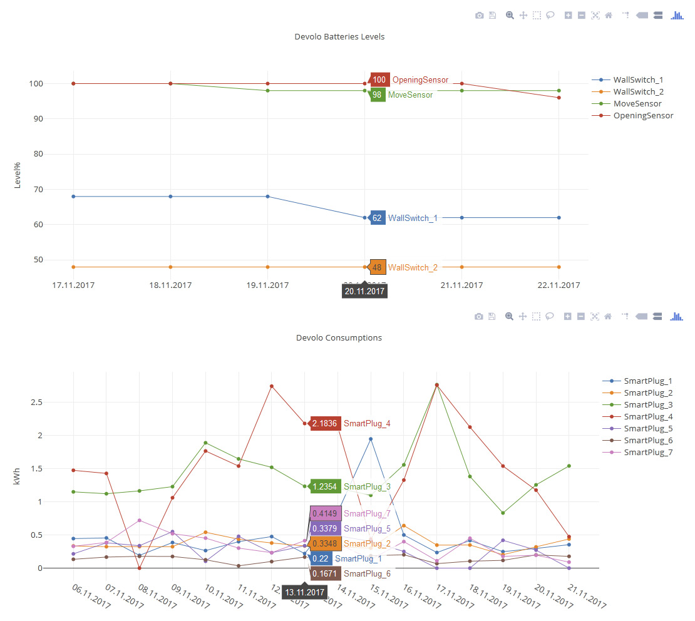

# php-devoloDHC

## Extended logs viewer from php Devolo API

Here is a how-to to get your devices consumptions and battery levels visual feedback.

<p align="center">
  
</p>

## Requirements
- [Php Devolo API ready to run](https://github.com/KiboOst/php-devoloDHC)
- cronLog.php
- showLog.html
- Display is supported thanks to [jQuery](https://jquery.com/) and [plotly](https://plot.ly/), both linked on their CDN (nothing to install/download)


## Get logs

You will have to log consumptions and battery levels everyday.
- Download cronLog.php on your server
- Edit cronLog.php so it can login to your Devolo DHC and change paths for both consumption and battery logs:

```php
//logs paths:
$consumptionsLogPath = $_SERVER['DOCUMENT_ROOT'].'/path/to/DHCconsumptions.json';
$batteriesLogPath = $_SERVER['DOCUMENT_ROOT'].'/path/to/DHCbatteries.json';

//API path:
require($_SERVER['DOCUMENT_ROOT'].'/path/to/phpDevoloAPI.php');

$_DHC = new DevoloDHC($login, $password);
if (isset($_DHC->error)) die($_DHC->error);

```

Don't touch the rest of the file.

- Call this file everyday. You can use IFTTT, set a sheduled task on NAS, or on cron task on your server or whatever will run the php page.

## Display logs

- Download showLog.html on your server
- Edit showLog.html

```html
<!doctype html>
<head>
    <script>
        var consumptionsLogPath = "DHCconsumptions.json"
        var batteriesLogPath = "DHCbatteries.json"
    </script>
```

Don't touch the rest of the file.

- Simply load this page in a browser when you have some logs!

## Version history

#### v0.1 (2017-11-22)
- First public version!

## License

The MIT License (MIT)

Copyright (c) 2017 KiboOst

Permission is hereby granted, free of charge, to any person obtaining a copy
of this software and associated documentation files (the "Software"), to deal
in the Software without restriction, including without limitation the rights
to use, copy, modify, merge, publish, distribute, sublicense, and/or sell
copies of the Software, and to permit persons to whom the Software is
furnished to do so, subject to the following conditions:

The above copyright notice and this permission notice shall be included in all
copies or substantial portions of the Software.

THE SOFTWARE IS PROVIDED "AS IS", WITHOUT WARRANTY OF ANY KIND, EXPRESS OR
IMPLIED, INCLUDING BUT NOT LIMITED TO THE WARRANTIES OF MERCHANTABILITY,
FITNESS FOR A PARTICULAR PURPOSE AND NONINFRINGEMENT. IN NO EVENT SHALL THE
AUTHORS OR COPYRIGHT HOLDERS BE LIABLE FOR ANY CLAIM, DAMAGES OR OTHER
LIABILITY, WHETHER IN AN ACTION OF CONTRACT, TORT OR OTHERWISE, ARISING FROM,
OUT OF OR IN CONNECTION WITH THE SOFTWARE OR THE USE OR OTHER DEALINGS IN THE
SOFTWARE.
